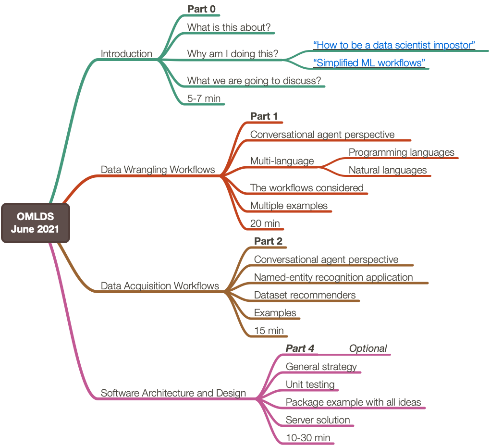

# Multi-language Data Wrangling and Acquisition Conversational Agents
[Orlando Machine Learning and Data Science](https://www.meetup.com/Orlando-MLDS/events/278910791)   
2021-07-26   
Tutorial and software architecture presentation   

[This presentation](https://www.meetup.com/Orlando-MLDS/events/278910791), [AA1],
was a combination previous presentation, [AAv1], on data wrangling and new material on data acquisition.
Compared to other presentations this one was much more software-architecture content.

Here is the mind-map used for the presentation:

Here is the abstract:

> In this month's talk, Anton will be showcasing his work on 
> Multi-language Data Wrangling and Acquisition Conversational Agents. 
> Current data acquisition and wrangling methods require user knowledge in multiple packages and languages. 
> These agents address this knowledge gap by simplifying the process of building data acquisition and 
> data wrangling pipelines using natural language, enabling data scientists to quickly get a feel for their data 
> in a fast and language agnostic manner. 
> The talk comes with a number of references, including Anton's own repositories and 
> other talks he gave on the subject.

Here is a recording of the presentation at YouTube, [AAv2]:

- ["Multi-language Data Wrangling and Acquisition Conversational Agents"](https://youtu.be/8B4_mkU_XW0).

That video recording is long, over 2 hours. (The timings in the mind-map were very loosely followed...)

------

## References

### Articles, announcements

[AA1] Anton Antonov,
["Multi-language Data Wrangling and Acquisition Conversational Agents"](),
(2021),
[Orland Machine Learning and Data Science Meetup](https://www.meetup.com/Orlando-MLDS/events/278910791).

### Video recordings

[AAv1] Anton Antonov,
["Multi-language Data-Wrangling Conversational Agent"](https://www.youtube.com/watch?v=pQk5jwoMSxs),
(2020),
[Wolfram Technology Conference, 2020](https://www.wolfram.com/events/technology-conference/2020/).

[AAv2] Anton Antonov,
["Multi-language Data Wrangling and Acquisition Conversational Agents"](https://www.youtube.com/watch?v=8B4_mkU_XW0),
(2021),
[OMLDS YouTube channel](https://www.youtube.com/channel/UCoTuN2KVQHpnAOO9nM9354Q).
